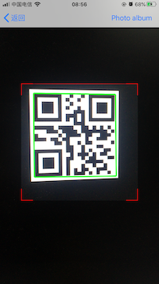

# QRScanner

[](https://travis-ci.org/izhoubin/QRScanner)
[](https://cocoapods.org/pods/QRScanner)
[](https://cocoapods.org/pods/QRScanner)
[](https://cocoapods.org/pods/QRScanner)
[](http://cocoapods.org/pods/QRScanner)

## Preview

## Features
A simple iOS qrCode scanner with swift 5.0

- [x] Simple to use
- [x] Highly Customizable
- [x] Automatic display flashlight button when light is low
- [x] Mark the rect of qrcode
- [x] Scan with animation
- [x] Demo available

## Example

To run the example project, clone the repo, and run `pod install` from the Example directory first.

## Requirements

iOS 9.0 / Swift 5.0

## Installation

QRScanner is available through [CocoaPods](https://cocoapods.org). To install
it, simply add the following line to your Podfile:

```ruby
pod 'QRScanner'
```
## Tips

Don't forget to add Privacy - Camera Usage Description & Privacy - Photo Library Usage Description to your Info.plist

## Author

izhoubin, 121160492@qq.com

## License

QRScanner is available under the MIT license. See the LICENSE file for more info.
